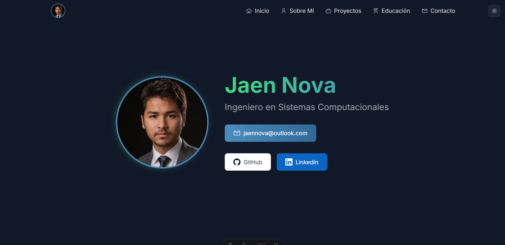

<div align="center">

# 🌟 Portfolio Personal



✨ Un portfolio moderno y personalizable desarrollado con **Astro**, **Svelte** y **TailwindCSS**.

[**🌐 Demo**](https://jaenn.netlify.app) · [🎨 Personalización](./src/data/)

</div>

---

## ✨ Características

- **Diseño responsive y minimalista** 📱💻  
- **Modo oscuro/claro** 🌙☀️  
- **Animaciones fluidas** 🎥  
- **Optimizado para SEO** 🚀  
- **Fácil personalización vía JSON** 🛠️  
- **Secciones incluidas**: Hero, About, Projects, Experience, Skills, Contact

---

## 🛠️ Instalación

Sigue estos pasos para comenzar a usar el portfolio:

```bash
git clone https://github.com/jaennova/portfolio-svelte.git
cd portfolio-svelte
npm install
npm run dev
```

---

## 📂 Estructura del Proyecto

```plaintext
/
├── src/
│   ├── components/    # Componentes Svelte
│   ├── data/          # Configuración JSON
│   │   ├── personal.json    # Información personal
│   │   ├── projects.json    # Proyectos
│   │   ├── experience.json  # Experiencia
│   │   └── skills.json      # Habilidades
│   ├── layouts/      # Layouts Astro
│   └── pages/        # Páginas
└── public/           # Activos estáticos
```

---

## ⚙️ Personalización

Personaliza tu portfolio editando los archivos JSON en `src/data/`:

<details>
<summary><strong>📄 personal.json</strong></summary>

```json
{
    "name": "Jhon Doe",
    "role": "Ingeniero en Sistemas Computacionales",
    "profile": {
        "image": "profile.png",
        "alt": "Jhon Doe"
    },
    "description": "lorem ipsum.",
    "cv": "cv.pdf",
    "contact": {
        "email": {
            "icon": "carbon:email",
            "title": "Email",
            "value": "jhon@doe.com",
            "link": "mailto:jhon@doe.com"
        }
    }
}
```
</details>

<details>
<summary><strong>📄 projects.json</strong></summary>

```json
{
  "projects": [
    {
      "id": 1,
      "title": "Proyecto",
      "description": "Descripcion del proyecto.",
      "technologies": ["Android", "JetpackCompose", "Kotlin", "Room"],
      "image": "/projects/logoproyecto.webp",
      "github": "https://github.com/usuario/proyecto",
      "live": "https://linkproyecto.com"
    },
  ]
}
```
</details>

<details>
<summary><strong>📄 experience.json</strong></summary>

```json
{
  "work": [
    {
      "position": "Desarrollador Web",
      "company": "Cliente Privado",
      "period": "2024",
      "type": "Freelance",
      "icon": "simple-icons:astro",
      "achievements": [
        "algo destacado",
        "otra cosa destacada.",
      ]
    }
  ],
  "education": [
    {
      "certification": "Universidad",
      "issuer": "Ingenieria en Sistemas Computacionales",
      "year": "2020 - 2025",
      "icon": "carbon:education",
      "goals":[
        "Especialidad"
      ]
    }
  ]
}
```
</details>

<details>
<summary><strong>📄 skills.json</strong></summary>

```json
{
    "hardSkills": [{
        "name": "Habilidad",
        "icon": "icon-name"
    }],
    "softSkills": ["Habilidad 1", "Habilidad 2"]
}
```
</details>

---

## 🚀 Scripts Disponibles

Comandos principales para ejecutar el proyecto:

```bash
npm run dev      # Modo desarrollo (localhost:4321)
npm run build    # Generar build de producción
npm run preview  # Previsualizar build en local
```

---

## 🛠️ Stack Tecnológico

- [**Astro**](https://astro.build) - Framework web  
- [**Svelte**](https://svelte.dev) - Framework UI  
- [**TailwindCSS**](https://tailwindcss.com) - Estilos  
- [**Motion**](https://motion.dev) - Animaciones  
- [**Iconify**](https://iconify.design) - Iconos  

---

## 📄 Licencia

MIT © [**Jaen Nova**](https://github.com/jaennova)
